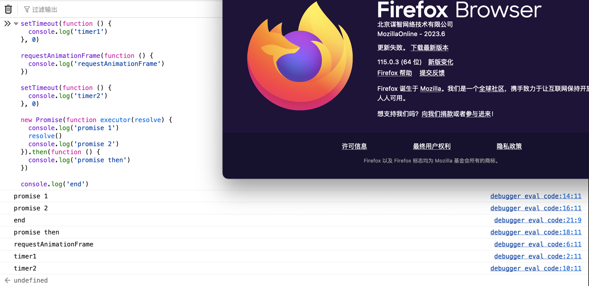
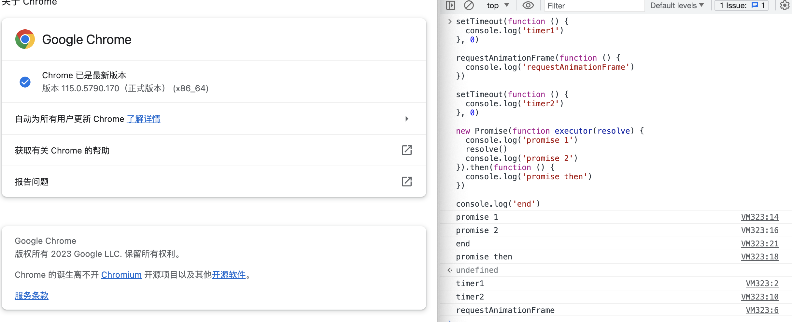

- [面试题](#面试题)
  - [JS原理类](#js原理类)
    - [关于遍历](#关于遍历)
      - [对象类遍历](#对象类遍历)
        - [Object.keys](#objectkeys)
    - [数据类型](#数据类型)
      - [引用类型](#引用类型)
        - [JavaScript全局函数](#javascript全局函数)
      - [类型转换](#类型转换)
    - [对象API](#对象api)
    - [数组API](#数组api)
    - [事件循环机制](#事件循环机制)
      - [特殊情况](#特殊情况)
        - [](#)
    - [浅拷贝与深拷贝](#浅拷贝与深拷贝)
      - [浅拷贝](#浅拷贝)
      - [深拷贝](#深拷贝)
    - [incetanceof](#incetanceof)
  - [算法类](#算法类)
    - [排序](#排序)
    - [数据处理](#数据处理)
      - [利用栈处理数据](#利用栈处理数据)

# 面试题  

## JS原理类  

### 关于遍历  

#### 对象类遍历  

##### Object.keys  

原理：  


### 数据类型  

#### 引用类型  

##### JavaScript全局函数  
1. parseInt()  
parseInt() 函数可解析一个字符串，并返回一个整数。  
当参数 radix 的值为 0，或没有设置该参数时，parseInt() 会根据 string 来判断数字的基数。  
当忽略参数 radix , JavaScript 默认数字的基数如下:  
如果 string 以 "0x" 开头，parseInt() 会把 string 的其余部分解析为十六进制的整数。
如果 string 以 0 开头，那么字符解析为八进制或十六进制的数字。
如果 string 以 1 ~ 9 的数字开头，parseInt() 将把它解析为十进制的整数。

参考：https://www.runoob.com/jsref/jsref-obj-global.html  

例题： 
`[1,2,3].map(parseInt)`输出什么？  
结果为：  
```
1
NaN
NaN
```  
解析：  
```JavaScript  
// map的回调函数实际上成为
['1','2','3'].map((item,index)=>{
  return parseInt(item,index)
})

parseInt('1', 0, the_array) # 1
parseInt('2', 1, the_array) # NaN
parseInt('3', 2, the_array) # NaN
```  
参考：https://developer.mozilla.org/en-US/docs/Web/JavaScript/Reference/Global_Objects/Array/map#using_parseint_with_map  


#### 类型转换  
string变为number有哪些方法？ 

```JavaScript
// 1. Number()
var a = Number('23')
typeof a // 'number'

// 2. +
var a = +'2'
typeof a // 'number'

// 3. ParseInt  
var a = '13'
var b = parseInt(a)
console.log(b) // 13
```  

number变为string有哪些方法？  

```JavaScript
// 1. String()
var a = String(3)
typeof a // 'string'

// 2. Number.prototype.toString()
var count = 10;
console.log(count.toString()); // "10"

// 3. + ''
var a = 12
var b = a + '' // b为'12'
```


### 对象API  

Object.keys(7) 执行结果？  
`[]`

### 数组API  

[8,9].sort() 执行结果？  
`[8, 9]`

### 事件循环机制  

#### 特殊情况  
requestAnimationFrame  
~~ 同步任务 > 微任务 > requestAnimationFrame > DOM渲染 > 宏任务 ~~

```JavaScript
setTimeout(function () {
  console.log('timer1')
}, 0)

requestAnimationFrame(function () {
  console.log('requestAnimationFrame')
})

setTimeout(function () {
  console.log('timer2')
}, 0)

new Promise(function executor(resolve) {
  console.log('promise 1')
  resolve()
  console.log('promise 2')
}).then(function () {
  console.log('promise then')
})

console.log('end')
```  

不同浏览器环境执行结果：  
  
  
可得浏览器只保证 requestAnimationFrame 的回调在重绘之前执行，但没有确定的时间，何时重绘由浏览器决定。  

参考：[深入理解 JavaScript 之事件循环(Event Loop)](https://github.com/Jacky-Summer/personal-blog/blob/master/深入理解JavaScript系列/深入理解%20JavaScript%20之事件循环(Event%20Loop).md)

##### 

### 浅拷贝与深拷贝  

#### 浅拷贝  
浅拷贝都有哪些方法？  

... 为浅拷贝  

```JavaScript
// Baidu
let aa = {
    age: 1,
    jobs: {
        first: 'FE'
    }
}
let b = { ...aa }
aa.jobs.first = 'native'
console.log(b)
```  

#### 深拷贝  

```JavaScript
function deepClone(obj) {
    if(typeof obj !== 'object' || obj === null) {
        return obj
    }
    let result = {}
    if(obj instanceof Array) {
        result = []
    }
    for(let key in obj) {
        if(obj.hasOwnProperty(key)) {
            result[key] = deepClone(obj[key])
        }
    }
    return result
}
```

### incetanceof  

```JavaScript
function new_instanceof(leftVaule, rightVaule) {
    if(typeof leftVaule !== 'object' && typeof leftVaule !== 'function' || leftVaule === null) {
        return false
    }
    if(rightVaule === null) {
        return leftVaule === Object.prototype
    }
    let right = rightVaule.prototype; // 取右的 prototype 值
    let left = leftVaule.__proto__; // 取左的__proto__值
    while (true) {
    	if (left === null) {
            return false;	
        }
        if (left === right) {
            return true;	
        } 
        left = left.__proto__
    }
}
console.log(new_instanceof(Function, Function)) // Function.__proto__ === Function.prototype
console.log(new_instanceof(Function.prototype, Object)) // Function.prototype.__proto__ === Object.prototype
console.log(new_instanceof(Object, Function)) // Object.__proto__ === Function.prototype
console.log(new_instanceof(Object.prototype, null)) // Object.prototype.__proto__ === null
var a = function people() {}
var b = new a()
console.log(new_instanceof(b, a)) // b.__proto__ === a.prototype
console.log(new_instanceof(a, Function)) // a.__proto__ === Function.prototype
console.log(new_instanceof(a.prototype, Object)) // a.prototype.__proto__ === Object.prototype
console.log(new_instanceof(b, Object))
// 共打印8个true
```  

```JavaScript
// 法2
function myInstanceof (obj, constructor) {
  let proto = Object.getPrototypeOf(obj); // 实例对象的原型
  while (true) {
    if (proto === null) { // 到达尽头
      return false;
    }
    if (proto === constructor.prototype) { // 找到了
      return true;
    }
    proto = Object.getPrototypeOf(proto); // 沿着原型链继续找
  }
}
// 这里的 Object.getPrototypeOf(obj) 可以使用 obj.__proto__ 代替。但是推荐使用 Object.getPrototypeOf(obj)，因为 __proto__ 已经被弃用了。  
// https://developer.aliyun.com/article/936735
```  

## 算法类  

### 排序  

### 数据处理  

#### 利用栈处理数据  

例题：Baidu  
给定一个只包括 '('，')'，'{'，'}'，'['，']' 的字符串 s ，判断字符串是否有效。有效字符串需满足：  
左括号必须用相同类型的右括号闭合。  
左括号必须以正确的顺序闭合。  

```JavaScript
function isValid(str) {
    let stack = []
    for(let i = 0; i < str.length; i++) {
        let item = str[i]
        switch (item){
            case '[': {
                stack.push(']')
                break
            }
            case '{': {
                stack.push('}')
                break
            }
            case '(': {
                stack.push(')')
                break
            }
            default: {
                if(item !== stack.pop()) {
                    return false
                }
            }
        }
    }
    return stack.length === 0
}
console.log('{([])}', isValid('{([])}')) // true
console.log('{([)}', isValid('{([)}')) // false
console.log('{([()', isValid('{([()')) // false
console.log('[](){}', isValid('[](){}')) // true
```
