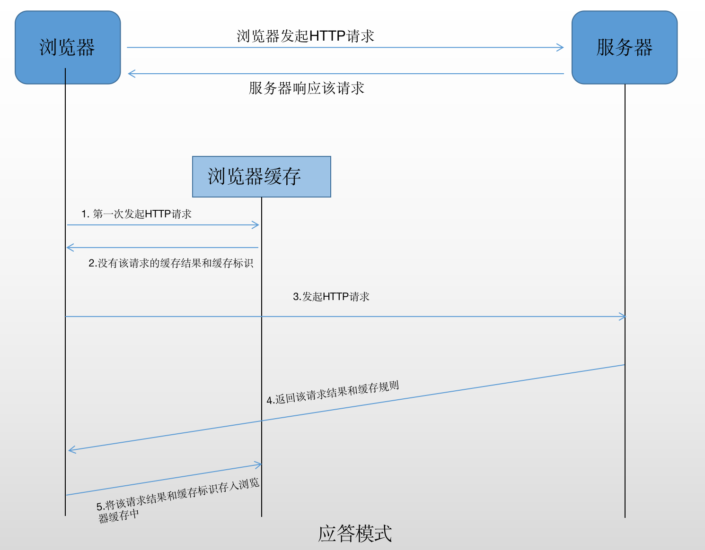

- [网络相关知识点](#网络相关知识点)
  - [http基础知识](#http基础知识)
    - [http Header](#http-header)
    - [常见状态码](#常见状态码)
    - [Restful-API](#restful-api)
    - [http缓存](#http缓存)
      - [浏览器的缓存存放在哪里？](#浏览器的缓存存放在哪里)
        - [内存缓存(from memory cache)](#内存缓存from-memory-cache)
        - [硬盘缓存(from disk cache)](#硬盘缓存from-disk-cache)
      - [cache-control 与 http强制缓存](#cache-control-与-http强制缓存)
        - [强制缓存](#强制缓存)
      - [Etag和Last-Modified http协商缓存](#etag和last-modified-http协商缓存)
    - [HTTPS](#https)
  - [网络连接](#网络连接)
    - [页面加载形式](#页面加载形式)
      - [加载过程](#加载过程)
      - [渲染过程](#渲染过程)
    - [从输入url到看到页面发生了什么？](#从输入url到看到页面发生了什么)
  - [ajax](#ajax)
    - [手写ajax](#手写ajax)
    - [封装jQuery的API-jQuery.ajax(url, method, body, success, fail)](#封装jquery的api-jqueryajaxurl-method-body-success-fail)
  - [网络安全](#网络安全)
    - [浏览器的同源策略](#浏览器的同源策略)
    - [跨域](#跨域)
      - [jsonp](#jsonp)
      - [CORS](#cors)
    - [XSS攻击](#xss攻击)
      - [定义](#定义)
      - [防御](#防御)
    - [CSRF攻击](#csrf攻击)
      - [定义](#定义-1)
      - [防御](#防御-1)
# 网络相关知识点  

## http基础知识  
### http Header

### 常见状态码  
1xx  Informational(信息性状态码) - 接收的请求正在处理
2xx  Success(成功状态码) - 请求正常处理完毕
3xx  Redirection(重定向状态码)
4xx  Client Error(客户端错误状态码)
5xx  Server Error(服务器错误状态码)  

常用状态码
1 | 2 | 3 | 4  
-- | -- | -- | --
服务器上没有请求的资源 | 404 |  Not Found | 表明服务器上无法找到请求的资源。另外也可在服务器端拒绝请求且不想说明理由时用。  
 ~ | 405 | Method Not Allowed |  ~  


### Restful-API  
Restful API是一种新的API设计方法(早已推广使用)  
传统API设计：把每个url当作一个功能  
Restful API设计：把每个url当作一个唯一的资源  
如何设计成一个资源？  
1) 尽量不使用url参数  
传统API设计: /api/list?pageIndex=2  
Restful API设计: /api/list/2  

2) 用method表示操作类型
(传统API设计)如：  
post请求  
post请求  
get请求  
Restful API设计：  
post请求：/api/blog  
patch请求: /api/blog/100  
get请求：/api/blog/100
delete请求：


### http缓存  
描述一下http的缓存机制   

#### 浏览器的缓存存放在哪里？  
##### 内存缓存(from memory cache)  
使用内存中的缓存  
1. 优点：  
· 快速读取 （存进进程内存）  
· 时效性 （进程关闭，该进程内存清空）  
2. JS、图片等文件  
   
##### 硬盘缓存(from disk cache)  
使用硬盘中的缓存  
1. 写入硬盘缓存，读取则需I/O操作，读取复杂、速度慢。  
2. CSS文件(每次渲染页面都需要从硬盘读取缓存)  

浏览器读取缓存顺序：memory -> disk  

#### cache-control 与 http强制缓存  
##### 强制缓存  
向浏览器缓存查找该请求结果，并根据该结果的缓存规则来决定是否使用该缓存结果的过程。  


#### Etag和Last-Modified http协商缓存  

### HTTPS  
HTTP + 加密 + 认证 + 完整性保护 = HTTPS  
HTTP：TCP IP  
HTTPS：SSL TCP IP  
SSL是当今世上应用最为广泛的网络安全技术。  

## 网络连接  

### 页面加载形式  

#### 加载过程  
DNS解析：域名->IP地址  
浏览器根据IP地址向服务器发起http请求  
服务器处理http请求并返回给浏览器  

#### 渲染过程  
根据HTML代码生成DOM树  
根据CSS代码生成CSSOM  
将DOM Tree 和 CSSOM 整合形成Render Tree 

根据Render Tree渲染页面  
遇到`<script>`则暂停渲染，优先加载并执行script  
直至渲染完成


### 从输入url到看到页面发生了什么？  
1.输入url  
2.DNS解析  
3.Server处理  
4.浏览器处理

## ajax  
### 手写ajax  
```
let request = new XMLHttpRequest();
request.open('get', '/xxx'); // 配置request
request.send();
request.onreadystatechange = () => {
    if(request.readyState === 4) {
        if(request.status >= 200 && request.status < 300) {
            console.log('请求成功')
        } else {
            console.log('请求失败')
        }
    }
}
```  
### 封装jQuery的API-jQuery.ajax(url, method, body, success, fail)  
```
window.jQuery = function(nodeOrSelector) {
    let nodes = {}
    nodes.addClass = function() {}
    node.html = function() {}
    return nodes
}
window.$ = winndow.jQuery
window.jQuery.ajax = function(url, method, body, successFn, failFn, headers) {
    let request = new XMLHttpRequest()
    request.open(method, url) // 配置request
    for(let key in headers) {
        let value = headers[key]
        request.setRequestHeader(key, value)
    }
    request.onreadystatechange = () => {
        if(request.readyState === 4) {
            if(request.status >= 200 && request.status < 300) {
                successFn.call(undefined, request.responseText)
            } else if (request.status >= 400) {
                failFn.call(undefined, request)
            }
        }
    }
    request.send(body)
}

function f1(responseText) {}
function f2(responseText) {}

myButton.addEventListener('click', (e) => {
    window.jQuery.ajax({
        url: '/abc',
        method: 'get',
        headers: {
            'content-type': 'application/x-www-form-urlencoded',
            'age': '18'
        },
        successFn: (x) => {
            f1.call(undefined, x)
            f2.call(undefined, x)
        },
        failFn: (x) => {
            console.log(x)
            console.log(x.status)
            console.log(x.responseText)
        }
    })
})
```  
升级以上的jQuery.ajax() 以满足Promise规则  
```
window.jQuery = function(nodeOrSelector) {
    let nodes = {}
    nodes.addClass = function(){}
    nodes.html = function(){}
    return nodes
}
window.$ = window.jQuery
window.Promise = function(fn) {
    // ...
    return {
        then: function() {}
    }
}
window.jQuery.ajax = function(url, method, body, headers) {
    return new Promise(function(resolve, reject) {
        let request = new XMLHttpRequest()
        request.open(method, url) // 配置request
        for(let key in headers) {
            let value = headers[key]
            request.setRequestHeader(key, value)
        }
        request.onreadystatechange = () => {
            if(request.readyState === 4) {
                if(request.status >= 200 && request.status < 300) {
                    resolve.call(undefined, request.responseText)
                } else if(request.status >= 400) {
                    reject.call(undefined, request)
                }
            }
        }
        request.send(body)
    })
}

myButton.addEventListener('click', (e) => {
    let promise = window.jQuery.ajax({
        url: '/abc',
        method: 'get',
        headers: {
            'content-type': 'application/x-www-form-urlencoded',
            'age': '18'
        }
    })
    promise.then(
        (text) => { console.log(text) },
        (request) => { console.log(request) }
    )
})
```  


## 网络安全  

### 浏览器的同源策略  
ajax请求时，浏览器要求当前网页和server必须同源(安全)  
同源：协议、域名、端口 3者必须一致

### 跨域  
所有跨域都必须经过server端允许和配合  
未经server端允许就实现跨域，说明浏览器有漏洞，危险信号  

#### jsonp  
`<script>`可绕过
#### CORS  
服务器设置http header 

### XSS攻击  
#### 定义  
#### 防御

### CSRF攻击  
#### 定义  
#### 防御  
抵御CSRF攻击关键在于：在请求中放入攻击者所不能伪造的信息，且该信息不存在于cookie中。  
开发者可在HTTP请求中以参数形式加入一个随机产生的token，并在服务器端建立一个拦截器来验证这个token。若请求中请求中没有token或token内容不正确，则认为可能是CSRF攻击而拒绝。  
token可以在用户登录后于服务端产生并放于session中，然后在每次请求把token从session中拿出，与请求中的token进行对比。