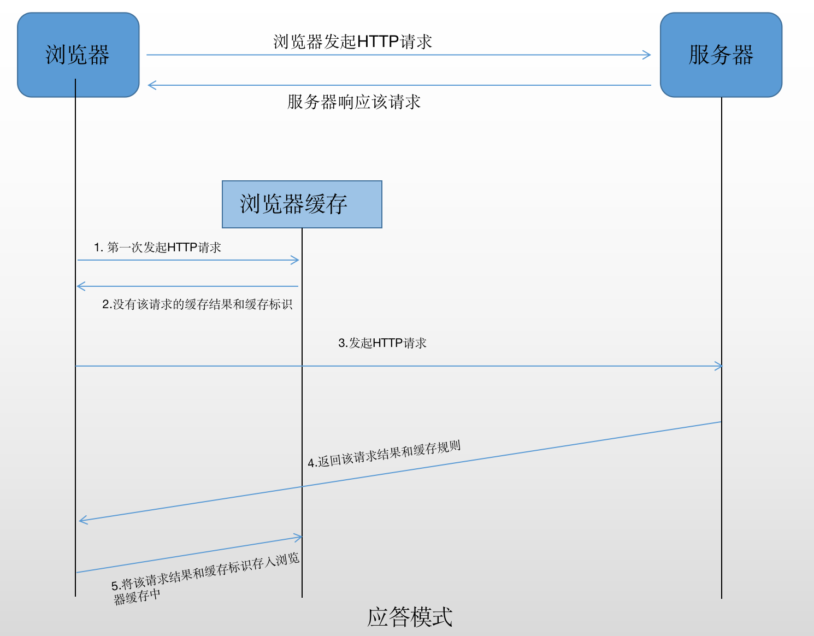
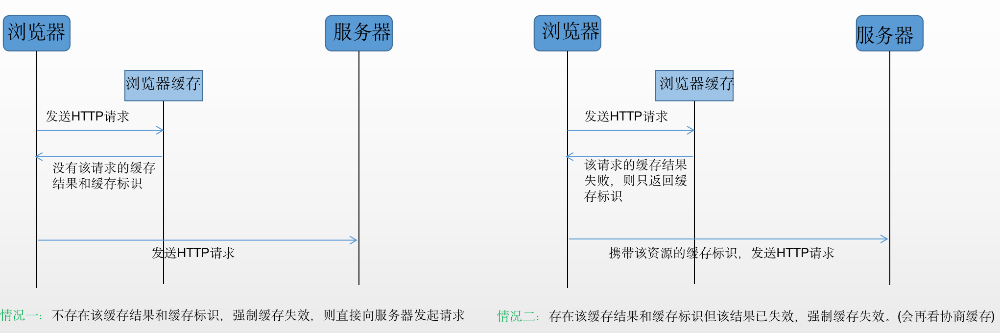
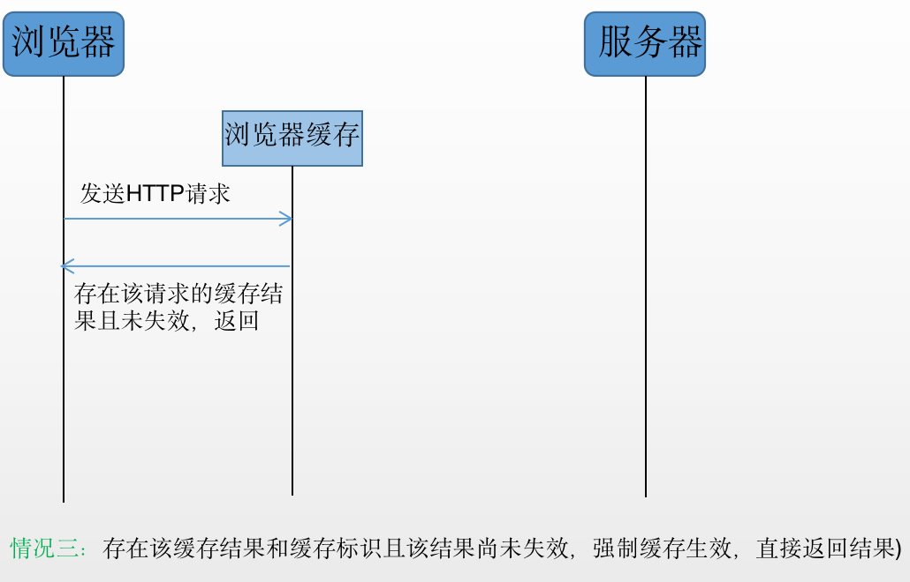
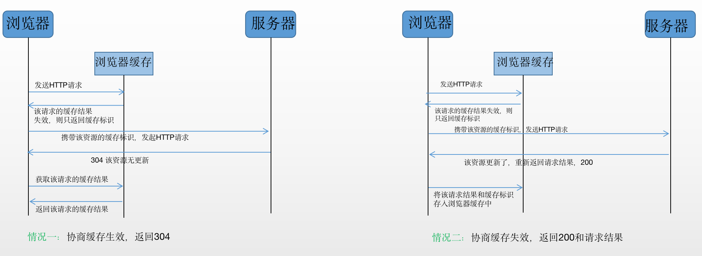

- [网络相关知识点](#网络相关知识点)
  - [http基础知识](#http基础知识)
    - [http Header](#http-header)
    - [常见状态码](#常见状态码)
    - [Restful-API](#restful-api)
    - [http缓存](#http缓存)
      - [浏览器缓存](#浏览器缓存)
      - [http强制缓存](#http强制缓存)
        - [强制缓存](#强制缓存)
        - [Expires](#expires)
        - [cache-control](#cache-control)
      - [http协商缓存](#http协商缓存)
        - [协商缓存](#协商缓存)
        - [Last-Modified](#last-modified)
        - [Etag](#etag)
      - [实际场景](#实际场景)
        - [频繁变动的资源](#频繁变动的资源)
        - [不常变动的资源](#不常变动的资源)
      - [浏览器的缓存存放在哪里？](#浏览器的缓存存放在哪里)
        - [内存缓存(from memory cache)](#内存缓存from-memory-cache)
        - [硬盘缓存(from disk cache)](#硬盘缓存from-disk-cache)
    - [HTTPS](#https)
  - [网络连接](#网络连接)
    - [页面加载形式](#页面加载形式)
      - [加载过程](#加载过程)
      - [渲染过程](#渲染过程)
    - [从输入url到看到页面发生了什么？](#从输入url到看到页面发生了什么)
  - [ajax](#ajax)
    - [手写ajax](#手写ajax)
    - [封装jQuery的API-jQuery.ajax(url, method, body, success, fail)](#封装jquery的api-jqueryajaxurl-method-body-success-fail)
    - [fetch](#fetch)
    - [axios](#axios)
        - [interceptors](#interceptors)
  - [网络安全](#网络安全)
    - [浏览器的同源策略](#浏览器的同源策略)
    - [跨域](#跨域)
      - [jsonp](#jsonp)
      - [CORS](#cors)
    - [XSS攻击](#xss攻击)
      - [定义](#定义)
      - [防御](#防御)
    - [CSRF攻击](#csrf攻击)
      - [定义](#定义-1)
      - [防御](#防御-1)
# 网络相关知识点  

## http基础知识  
### http Header

### 常见状态码  
1xx  Informational(信息性状态码) - 接收的请求正在处理
2xx  Success(成功状态码) - 请求正常处理完毕
3xx  Redirection(重定向状态码)
4xx  Client Error(客户端错误状态码)
5xx  Server Error(服务器错误状态码)  

常用状态码
1 | 2 | 3 | 4  
-- | -- | -- | --
服务器上没有请求的资源 | 404 |  Not Found | 表明服务器上无法找到请求的资源。另外也可在服务器端拒绝请求且不想说明理由时用。  
 ~ | 405 | Method Not Allowed |  ~  


### Restful-API  
URL定位资源，用HTTP动词（GET,POST,DELETE,DETC）描述操作。  
通俗解释：看Url就知道要什么，看http method就知道干什么，看http status code就知道结果如何。  

Restful API是一种新的API设计方法(早已推广使用)  
传统API设计：把每个url当作一个功能  
Restful API设计：把每个url当作一个唯一的资源  
如何设计成一个资源？  
1) 尽量不使用url参数  
传统API设计: /api/list?pageIndex=2  
Restful API设计: /api/list/2  

2) 用method表示操作类型
(传统API设计)如：  
post请求  
post请求  
get请求  
Restful API设计：  
post请求：/api/blog  
patch请求: /api/blog/100  
get请求：/api/blog/100
delete请求：


### http缓存  
描述一下http的缓存机制   
  

#### 浏览器缓存  
浏览器在加载资源时，根据请求头的expires和cache-control判断是否命中强缓存，是则直接从缓存读取资源，不会发请求到服务器。  
如果没有命中强缓存，浏览器一定会发送一个请求到服务器，通过last-modified和etag验证资源是否命中协商缓存，如果命中，服务器会将这个请求返回，但是不会返回这个资源的数据，依然是从缓存中读取资源。  
如果前面两者都没有命中，直接从服务器加载资源。  
异： 强缓存不发请求到服务器，协商缓存会发请求到服务器。  
同： 如果命中，都是从客户端缓存中加载资源，而不是从服务器加载资源数据。  

浏览器缓存过程  
1.浏览器第一次加载资源，服务器返回200，浏览器将资源文件从服务器上请求下载下来，并把response header及该请求的返回时间一并缓存；  
2.下一次加载资源时，先比较当前时间和上一次返回200时的时间差，如果没有超过cache-control设置的max-age，则没有过期，命中强缓存，不发请求直接从本地缓存读取该文件（如果浏览器不支持HTTP1.1，则用expires判断是否过期）；如果时间过期，则向服务器发送header带有If-None-Match和If-Modified-Since的请求；  
3.服务器收到请求后，优先根据Etag的值判断被请求的文件有没有做修改，Etag值一致则没有修改，命中协商缓存，返回304；如果不一致则有改动，直接返回新的资源文件带上新的Etag值并返回200；  
4.如果服务器收到的请求没有Etag值，则将If-Modified-Since和被请求文件的最后修改时间做比对，一致则命中协商缓存，返回304；不一致则返回新的last-modified和文件并返回200。  

浏览器缓存主要有以下几个优点：  
减少重复数据请求，避免通过网络再次加载资源，节省流量。  
降低服务器的压力，提升网站性能。  
加快客户端加载网页的速度， 提升用户体验。


#### http强制缓存  
强制缓存： 强制缓存是指在缓存期内，浏览器直接从缓存中获取资源，而不会向服务器发送请求。  
协商缓存： 协商缓存是指在缓存期内，浏览器向服务器发送请求，通过比较资源的最后修改时间或唯一标识符等信息，判断是否需要更新缓存。  

##### 强制缓存  
向浏览器缓存查找该请求结果，并根据该结果的缓存规则来决定是否使用该缓存结果的过程。
  
  
缓存规则：设置响应头  
Expires字段  
Cache-Control字段(优先级高)  

##### Expires  
Expires是HTTP/1.0控制网页缓存的字段，其值为服务器返回该请求结果缓存的到期时间，即再次发起该请求时，如果客户端的时间小于Expires的值时，直接使用缓存结果。   
```
Expires: Wed, 11 May 2018 07:20:00 GMT
```  
 
##### cache-control  
到了HTTP/1.1，Expires已经被Cache-Control替代，原因在于Expires控制缓存的原理是使用客户端的时间和服务端返回的时间做对比，那么如果客户端与服务端的时间因为某些原因（例如时区）发送误差，那么强制缓存则会直接失效。  
在HTTP/1.1中，Cache-Control是最重要的规则，主要用于控制网页缓存，主要取值为：
```
public：所有内容都将被缓存（客户端/代理服务器/CDN等）
private：只有客户端可以缓存，Cache-Control默认值
no-cache：客户端缓存内容，但是是否使用缓存则需要经过协商缓存来验证决定
no-store：所有内容都不会被缓存，即不使用强制缓存，也不使用协商缓存
max-age=xxx：缓存将在xxx秒后失效
```  
例如：`Cache-Control: max-age=315360000`


#### http协商缓存  

##### 协商缓存  
协商缓存即由服务器决定是否使用缓存。  
当强制缓存失效后，浏览器携带标识向服务器发起请求，由服务器根据缓存标识决定是否使用缓存。  


缓存规则：设置header
1. Last-Modified / If-Modified-Since  
2. Etag / If-None-Match (优先级高) 

##### Last-Modified  
Last-Modified / If-Modified-Since
浏览器第一次请求一个资源的时候，服务器返回的header中会加上Last-Modified，Last-Modified是服务器响应请求时，返回该资源文件在服务器最后被修改的时间。例如Last-Modify: Thu,31 Dec 2037 23:59:59 GMT。  
当浏览器再次请求该资源时，request的请求头中会包含If-Modify-Since，该值为缓存之前返回的Last-Modify值，通过此字段告诉服务器该资源上次请求返回的最后被修改时间。服务器收到该请求，发现请求头含有If-Modified-Since字段，则会根据If-Modified-Since的字段值与该资源在服务器的最后被修改时间做对比，若服务器的资源最后修改时间大于If-Modified-Since的字段值，则重新返回资源，状态码为200；否则命中缓存返回304，代表资源无更新不会返回资源内容，可以继续使用缓存文件，并且不会返回Last-Modified。  

##### Etag  
Etag是服务器响应请求时，返回当前资源文件的一个唯一标识（由服务器生成）。  
If-None-Match是客户端再次发起请求时，携带上次请求返回的唯一标识Etag值，服务端收到该请求后，发现该请求含有If-None-Match，则会根据If-None-Match的字段值与该资源在服务器的Etag值做对比，一致则返回304，代表资源无更新，继续使用缓存文件，否则重新返回资源，状态码为200。  
某些文件虽然更新时间（last-modified）变化了，但是内容其实并没有变化。所以用ETag表示文件内容是否变更，相当于一个版本号。Etag要优于Last-Modified。Last-Modified的时间单位是秒，如果某个文件在1秒内改变了多次，那么他们的Last-Modified其实并没有体现出来修改，但是Etag每次都会改变确保了精度；


#### 实际场景  
##### 频繁变动的资源  
对于频繁变动的资源，首先要用 Cache-Control: no-store 使浏览器不适用缓存，从而每次都请求服务器。  
##### 不常变动的资源  
HTML文件一般不缓存或缓存时间很短，所以这里的文件指的是除HTML文件以外的代码文件。  
当我们用打包工具打包代码时，文件名会被进行哈希处理，只有文件被修改时才会生成新的文件名。  
这样我们就可以给代码文件设置缓存有效期为一年，Cache-Control: max-age=31536000 ，这样只有当HTML中引入的文件名发生改变之后才会去请求新的代码文件，否则就会一直使用缓存。  


#### 浏览器的缓存存放在哪里？  
##### 内存缓存(from memory cache)  
从本地读取缓存，本会话由于访问过该网站，部分文件加载到内存中了，可以直接内存中读取，关闭浏览器或tab页后清空，不会出现from memory cache。  

使用内存中的缓存  
1. 优点：  
· 快速读取 （存进进程内存）  
· 时效性 （进程关闭，该进程内存清空）  
2. JS、图片等文件  
   
##### 硬盘缓存(from disk cache)  
从本地读取缓存，内存中没有，读取磁盘中的缓存文件。  

使用硬盘中的缓存  
1. 写入硬盘缓存，读取则需I/O操作，读取复杂、速度慢。  
2. CSS文件(每次渲染页面都需要从硬盘读取缓存)  

浏览器读取缓存顺序：memory -> disk  

在 chrome 中强缓存（虽然没有发出真实的 http 请求）的请求状态码返回是 200 (from cache)；而协商缓存如果命中走缓存的话，请求的状态码是 304 (not modified)。 不同浏览器的策略不同，在 Fire Fox中，from cache 状态码是 304.
其中 from cache 会分为 from disk cache 和 from memory cache. 从内存中获取最快，但是是 session 级别的缓存，关闭浏览器之后就没有了。  

### HTTPS  
HTTP + 加密 + 认证 + 完整性保护 = HTTPS  
HTTP：TCP IP  
HTTPS：SSL TCP IP  
HTTPS是身批SSL外壳的HTTP  

SSL是当今世上应用最为广泛的网络安全技术。  

## 网络连接  

### 页面加载形式  

#### 加载过程  
DNS解析：域名->IP地址  
浏览器根据IP地址向服务器发起http请求  
服务器处理http请求并返回给浏览器  

#### 渲染过程  
根据HTML代码生成DOM树  
根据CSS代码生成CSSOM  
将DOM Tree 和 CSSOM 整合形成Render Tree 

根据Render Tree渲染页面  
遇到`<script>`则暂停渲染，优先加载并执行script  
直至渲染完成


### 从输入url到看到页面发生了什么？  
1.输入url  
2.DNS解析  
3.Server处理  
4.浏览器处理

## ajax  
### 手写ajax  
```
let request = new XMLHttpRequest();
request.open('get', '/xxx'); // 配置request
request.send();
request.onreadystatechange = () => {
    if(request.readyState === 4) {
        if(request.status >= 200 && request.status < 300) {
            console.log('请求成功')
        } else {
            console.log('请求失败')
        }
    }
}
```  
### 封装jQuery的API-jQuery.ajax(url, method, body, success, fail)  
```
window.jQuery = function(nodeOrSelector) {
    let nodes = {}
    nodes.addClass = function() {}
    node.html = function() {}
    return nodes
}
window.$ = winndow.jQuery
window.jQuery.ajax = function(url, method, body, successFn, failFn, headers) {
    let request = new XMLHttpRequest()
    request.open(method, url) // 配置request
    for(let key in headers) {
        let value = headers[key]
        request.setRequestHeader(key, value)
    }
    request.onreadystatechange = () => {
        if(request.readyState === 4) {
            if(request.status >= 200 && request.status < 300) {
                successFn.call(undefined, request.responseText)
            } else if (request.status >= 400) {
                failFn.call(undefined, request)
            }
        }
    }
    request.send(body)
}

function f1(responseText) {}
function f2(responseText) {}

myButton.addEventListener('click', (e) => {
    window.jQuery.ajax({
        url: '/abc',
        method: 'get',
        headers: {
            'content-type': 'application/x-www-form-urlencoded',
            'age': '18'
        },
        successFn: (x) => {
            f1.call(undefined, x)
            f2.call(undefined, x)
        },
        failFn: (x) => {
            console.log(x)
            console.log(x.status)
            console.log(x.responseText)
        }
    })
})
```  
升级以上的jQuery.ajax() 以满足Promise规则  
```
window.jQuery = function(nodeOrSelector) {
    let nodes = {}
    nodes.addClass = function(){}
    nodes.html = function(){}
    return nodes
}
window.$ = window.jQuery
window.Promise = function(fn) {
    // ...
    return {
        then: function() {}
    }
}
window.jQuery.ajax = function(url, method, body, headers) {
    return new Promise(function(resolve, reject) {
        let request = new XMLHttpRequest()
        request.open(method, url) // 配置request
        for(let key in headers) {
            let value = headers[key]
            request.setRequestHeader(key, value)
        }
        request.onreadystatechange = () => {
            if(request.readyState === 4) {
                if(request.status >= 200 && request.status < 300) {
                    resolve.call(undefined, request.responseText)
                } else if(request.status >= 400) {
                    reject.call(undefined, request)
                }
            }
        }
        request.send(body)
    })
}

myButton.addEventListener('click', (e) => {
    let promise = window.jQuery.ajax({
        url: '/abc',
        method: 'get',
        headers: {
            'content-type': 'application/x-www-form-urlencoded',
            'age': '18'
        }
    })
    promise.then(
        (text) => { console.log(text) },
        (request) => { console.log(request) }
    )
})
```  

### fetch  

### axios  

##### interceptors  
拦截器是指当发送请求或者得到响应被then或catch处理之前对它们进行拦截，拦截后可对数据做一些处理，比如给请求数据添加头部信息，或对响应数据进行序列化，然后再传给浏览器，这些都可以在拦截器中进行。  

项目应用axios示例：  
```JavaScript
import axios from 'axios'
import Vue from 'vue'
import VueCookie from 'vue-cookie'

const vm = new Vue()
const Message = vm.$message

// 请求超时配置
axios.defaults.timeout = 100000
// 状态码配置
axios.defaults.validateStatus = function (status) {
  return status >= 200 && status < 600
}
axios.defaults.withCredentials = true
// 请求拦截器(添加头部信息)
axios.interceptors.request.use(
  config => {
    if (config.headers['Content-Type']) {
      config.headers['Content-Type'] = config.headers['Content-Type']
    } else {
      config.headers['Content-Type'] = 'application/json'
    }
    Object.assign(config.headers, {
      'Cache-Control': 'max-age=120',
      'X-CSRFToken': VueCookie.get('csrftoken')
    })
    return config
  },
  function (error) {
    // 对请求错误做处理
    return Promise.reject(error)
  }
)
// 响应拦截器
axios.interceptors.response.use(
  res => {
    if (res.status === 401) {
      // 处理响应
    } else if (res.status >= 400 && res.status < 600) {
      Message({
        showClose: false,
        message: res.data.message || '错误',
        type: 'error',
        duration: 2000
      })
      return Promise.reject(res)
    } else {
      return res
    }
  },
  error => {
    // 请求错误时做些事
    Message.error('错误')
    return Promise.reject(error)
  }
)

export default axios
```  
参考：https://www.cnblogs.com/konglxblog/p/15596135.html  


## 网络安全  

### 浏览器的同源策略  
ajax请求时，浏览器要求当前网页和server必须同源(安全)  
同源：协议、域名、端口 3者必须一致

### 跨域  
所有跨域都必须经过server端允许和配合  
未经server端允许就实现跨域，说明浏览器有漏洞，危险信号  

#### jsonp  
`<script>`可绕过
#### CORS  
服务器设置http header 

### XSS攻击  
#### 定义  
拿到用户信息

#### 防御

### CSRF攻击  
#### 定义  
CSRF(Cross-site request forgery)跨站请求伪造  
CSRF是借用了当前操作者的权限来偷偷地完成某个操作，而不是拿到用户的信息。  

#### 防御  
抵御CSRF攻击关键在于（加入各个层级的权限认证）：在请求中放入攻击者所不能伪造的信息，且该信息不存在于cookie中。  
开发者可在HTTP请求中以参数形式加入一个随机产生的token，并在服务器端建立一个拦截器来验证这个token。若请求中请求中没有token或token内容不正确，则认为可能是CSRF攻击而拒绝。  
token可以在用户登录后于服务端产生并放于session中，然后在每次请求把token从session中拿出，与请求中的token进行对比。  

参考：  
1. [前端进阶小书](https://zxpsuper.github.io/Demo/advanced_front_end/browser/cache.html)  
2. [缓存](https://github.com/amandakelake/blog/issues/41)  
3. [HTTP缓存之协商缓存和强制缓存](https://zhuanlan.zhihu.com/p/143064070)  
4. [都2022年了你可知道强制缓存、协商缓存？](https://zhuanlan.zhihu.com/p/484262036)  
5. [强制缓存和协商缓存的区别](https://cloud.tencent.com/developer/article/1985866)  
6. [浏览器的强缓存与协商缓存](https://segmentfault.com/a/1190000021661656)